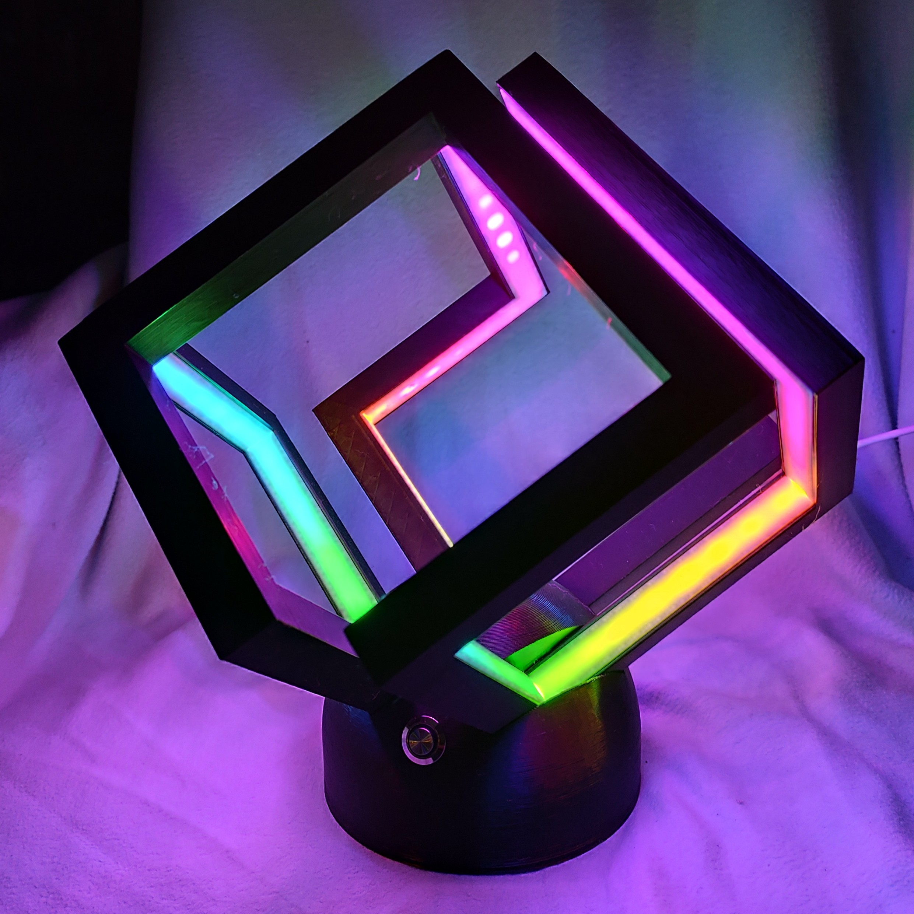
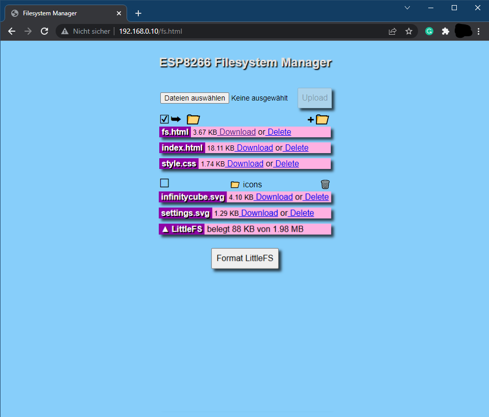

# Infinity Cube ESP8266

This repository contains the code for an Infinity Cube based on the ESP8266 microcontroller and NeoPixels.

## Table of Contents

- [Introduction](#introduction)
- [Features](#features)
- [Hardware Requirements](#hardware-requirements)
- [Quickstart](#quickstart)
- [Installation of Libraries](#installation-of-libraries)
- [Upload program to ESP8266 with Arduino IDE](#upload-program-to-esp8266-with-arduino-ide)
- [Resetting the Wi-Fi configuration](#resetting-the-wifi-configuration)
- [Remark about Logging](#remark-about-logging)
- [Contributing](#contributing)
- [License](#license)
- [References](#references)

## Introduction

The Infinity Cube is a mesmerizing LED cube based on NeoPixel LEDs and 3D printered parts. The original design of the cube is create by [James](https://www.printables.com/model/41750-infinity-cube-light?lang=de). The stand is inspired by the design from [here](https://www.suchenfindengewinnen.de/halter-fuer-die-infinity-cube-light/) but adjusted to hold an button and reduced printing time.
This repository completes completes the design with a software for ESP8266 to run and control the infinity cube. 

 


https://github.com/user-attachments/assets/56aa27b0-6a68-4ba6-a1dc-3c27f7a5b737


## Features

- control NeoPixel LEDs with ESP8266
- use seven predefined color modes
- one dynamic color shift mode
- change modes via press on physical button
- Wi-Fi connectivity for compehensive remote control via web interface
- time update via NTP server
- automatic summer/wintertime change
- easy Wi-Fi setup with WiFiManager
- configurable night mode (start and end time)
- customizable colors via webinterface


## Hardware Requirements

- ESP8266 (Wemos D1 mini)
- 156x NeoPixel WS2812B LED-strip 60/m
- push button with LED (e.g. [Amazon](https://amzn.to/3BQIWIM))
- USB-C female connector
- micro-USB male connector
- USB-Cable
- USB power supply (5V/3A)
- 3D printed parts (see [STL files](STL_files))
- Connecting wires and soldering tools

## Quickstart

1. Clone the project into the sketch folder of the Arduino IDE

```bash
git clone https://github.com/techniccontroller/infinity_cube_esp8266.git
```
2. Install the required libraries: [Installation](#installation-of-libraries).
3. Upload the program to the ESP8266 as usual: [Upload program to ESP8266](#upload-program-to-esp8266-with-arduino-ide). 
4. The implemented WifiManager helps you to set up a Wi-Fi connection with your home Wi-Fi -> on the first startup it will create a Wi-Fi access point named "infinitycubeAP". Connect your phone to this access point and follow the steps which will be shown to you. 
5. After a successful Wi-Fi setup, open the browser and enter the IP address of your ESP8266 to access the interface of the webserver. 
6. Here you can upload all files located in the folder "data". Please make sure all icons stay in the folder "icons" also on the webserver.
    - Open **http://\<ip-address\>/fs.html** in a browser
    - Upload **fs.html**
    - Upload **style.css**
    - Upload **index.html**
    - Create a new folder **icons**
    - Upload all icons into this new folder **icons**


  

## Installation of Libraries

Please download all these libraries as ZIP from GitHub, and extract them in the *libraries* folder of your Sketchbook location (see **File -> Preferences**). You can also install them via the Library Manager in the Arduino IDE.

- https://github.com/adafruit/Adafruit-GFX-Library
- https://github.com/adafruit/Adafruit_NeoPixel
- https://github.com/tzapu/WiFiManager
- https://github.com/adafruit/Adafruit_BusIO

The folder structure should look like this after installation:

```
MySketchbookLocation 
│
└───libraries
│   └───Adafruit-GFX-Library
│   └───Adafruit_NeoPixel
│   └───WiFiManager
│   └───Adafruit_BusIO
│   
└───infinity_cube_esp8266
    │   infinity_cube_esp8266.ino
    │   (...)
    |
    └───data
        │   index.html
        |   (...)
        |
        └───icons 
```


## Upload program to ESP8266 with Arduino IDE

#### STEP1: Installation of Arduino IDE
First, the latest version of the Arduino IDE needs to be downloaded and installed from [here](https://www.arduino.cc/en/software).

#### STEP2: Installation of ESP8266 Arduino Core
To program the ESP8266 with the Arduino IDE, you need to install the board information first in Arduino IDE. To do that follow the following instructions:

- Start Arduino IDE and open the **File > Preferences** window.

- Enter http://arduino.esp8266.com/stable/package_esp8266com_index.json into the Additional Board Manager URLs field. You can add multiple URLs, separating them with commas.
    
    

- Open Boards Manager from **Tools > Board** menu and search for "esp8266".

- Click the install button.

- Don’t forget to select your ESP8266 board from **Tools > Board** menu after installation (e.g *NodeMCU 1.0*, or *LOLIN(WEMOS) D1 mini (clone)*).

    

#### STEP3: Upload a program to ESP8266

- Open `infinity_cube_esp8266.ino` in Arduino IDE
- Connect ESP8266 board with Computer
- Select right serial Port in **Tools > Port**
- Click on the upload button in the Arduino IDE to upload the program to the ESP8266 Module.

    


## Resetting the Wi-Fi configuration

You can clear the stored Wi-Fi credentials and restart the Wi-Fi setup described above with these steps:
1. Open the settings panel in the web UI.
2. Enable 'Reset Wi-Fi' slider.
3. Save settings.
4. LED test should be performed.
5. Disconnect and reconnect the power. Wi-Fi credentials were removed. The setup should be restarted.
Resetting the wifi credentials does not delete uploaded files.

## Remark about Logging

The infinity cube sends continuous log messages to the serial port and via multicast UDP. If you want to see these messages, you have to 

- open the serial monitor in the Arduino IDE (Tools -> Serial Monitor). The serial monitor must be set to 115200 baud.

OR

- run the following steps for the multicast UDP logging:

1. Starting situation: ESP8266 is connected to WLAN, a computer with installed Python (https://www.python.org/downloads/) is in the same local area network (WLAN or LAN doesn't matter).
3. Open the file `multicastUDP_receiver_analyzer.py` in a text editor and in line 81 enter the IP address of the computer (not the ESP8266!).
```python	
# ip address of network interface
MCAST_IF_IP = '192.168.0.7'
```
4. Execute the script with following command: 

```bash
python multicastUDP_receiver_analyzer.py
```

5. Now you should see the log messages of the ESP8266 (every 5 seconds a heartbeat message and the currently displayed time). 
If this is not the case, there could be a problem with the network settings of the computer, then recording is unfortunately not possible.

6. If special events (failed NTP update, reboot) occur, a section of the log is saved in a file called *log.txt*. 
In principle, the events are not critical and will occur from time to time, but should not be too frequent.


## Contributing

Contributions are welcome! Please fork this repository and submit a pull request with your improvements.

## License

This project is licensed under the MIT License. See the [LICENSE](LICENSE) file for details.

## References

- [Infinity Cube by James](https://www.printables.com/model/41750-infinity-cube-light?lang=de)
- [Stand for Infinity Cube](https://www.suchenfindengewinnen.de/halter-fuer-die-infinity-cube-light/)
